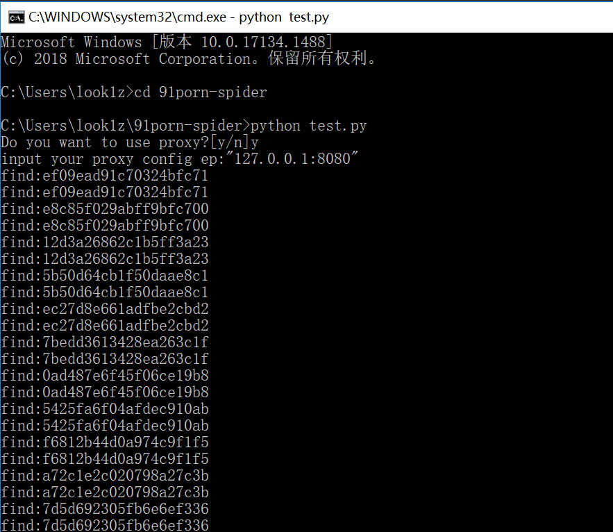
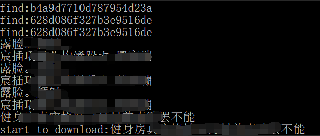
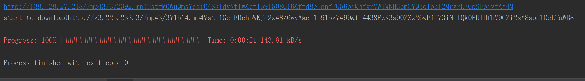

# 91spider
you can input the number of the posts of 91porn.
Then 91spider can download the picture automatically from the post in 91porn.

可以用来批量下载91视频，图片。

## 使用说明

代码编写于python2.7环境下，依赖于requests库，自行下载安装环境文件。

## test.py
test.py是91视频爬虫，源代码来自**91_spider**，7月31日优化了链接，代理（主要解决速度问题），多线程。

使用：
python test.py 线程数
如：
python test.py 10 将指定线程数为10

## test2.py
test2.py是91论坛图片爬虫，输入id区间即可批量下载图片

## 18年8月1日更新

更新了网站地址链接；

添加了代理功能，不使用代理的话，把requests.get中的proxy去掉即可；

添加了多线程下载，可以综合自己网络速度进行调试；

## 18年8月2日更新

对test.py的模块进行了备注；

## 18年9月22日更新

更新了代理判断，现在进入的时候可以自由选择是否开启代理与配置代理；

添加了进度条模块，视频下载时会有进度显示，并提供当前下载速度，预计完成时间等信息；

添加了线程参数，默认第一个参数为线程数（默认线程为5）；

## 20年6月6日更新

之前的版本不能使用了（91本身进行了大更新）

这里在原版本的基础上：
* 更新了新的正则匹配方式
* 更新了strdecode函数，解决91新的反爬加密
* 更新了之前一些小bug

使用方法：
1. 找到主函数，修改i来修改线程
2. 检查下base_url是否可以正常访问
3. 如果不能访问，需要配置代理（my_proxies）
4. 运行test.py，程序会询问是否需要代理(y/n)，根据自己需要选择
5. 如果想修改下载目录的话，要自己手动编辑一下t

图例：

python运行->选择是否代理(默认代理为127.0.0.1:8080)，不代理输入n->爬取热度页面视频的key->针对每个key进行页面访问得到视频地址下载

下载效果图：

这里我目前没好用的vps，简单下了一个就停止了，追求速度还是需要使用vps代理下载

# **本代码仅限于python学习使用，勿用于其他用途**

